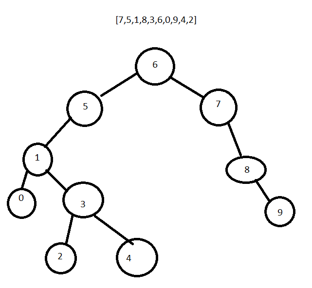

#  BINARY SEARCH TREE [7,5,1,8,3,6,0,9,4,2]

1. root = 6
2. 7 geldiğinde 6 dan büyüktür, sağ altına yerleşir.
3. 5 geldiğinde 6 dan küçüktür, sol altına yerleşir.
4. 1 geldiğinde 6'dan ve 5'ten küçüktür ve 5'in sol altına yerleşir
5. 8 geldiğinde 6'dan ve 7'den büyüktür ve 7'nin sağ altına yerleşir.
6. 3 geldiğinde 6'dan ve 5'den küçüktür, 1'den ise büyükten ve 1'in sağ altına yerleşir.
7. 0 geldiğinde 6'dan, 5'ten ve 1'den küçüktür ve 1'in soluna yerleşir.
8. 9 geldiğinde 6'dan, 7'den ve 8 den büyüktür ve 8',n sağ altına yerleşir.
9. 4 geldiğinde 6'dan ve 5'ten küçüktür, 1'den ve 3'ten büyüktür, 3'ün sağ altına yerleşir.
10. 2 geldiğinde 6'dan ve 5'ten küçüktür, 1'den  büyük ancak 3'ten küçüktür, 3'ün sol altına yerleşir.

